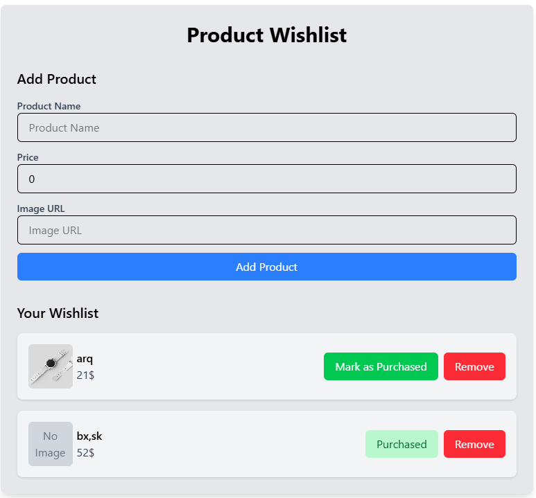

# Product Wishlist App

A simple Vue.js application that allows users to manage a wishlist of products. Users can add, mark as purchased, and remove products. The app uses modern Vue 3 features like the Composition API (`<script setup>`) and `localStorage` for persistence.

## Features

- **Add Products**: Add products with a name, price, and optional image URL.
- **Mark as Purchased**: Mark products as purchased to track progress.
- **Remove Products**: Remove unwanted products from the wishlist.
- **Persistent Storage**: The wishlist is saved in `localStorage`, so it persists even after refreshing the page.
- **Optional Image URL**: If no image URL is provided, a placeholder ("No Image") is displayed.

## Technologies Used

- **Vue 3**: Modern JavaScript framework for building user interfaces.
- **Composition API (`<script setup>`)**: Simplifies component logic and improves readability.
- **Tailwind CSS**: Utility-first CSS framework for styling.
- **TypeScript**: Adds type safety and improves developer experience.
- **localStorage**: Persists the wishlist data locally in the browser.

## How It Works

1. **Adding a Product**:
   - Fill out the form with the product's name, price, and (optional) image URL.
   - Click "Add Product" to add it to the wishlist.

2. **Marking as Purchased**:
   - Click the "Mark as Purchased" button to update the product's status.

3. **Removing a Product**:
   - Click the "Remove" button to delete a product from the wishlist.

4. **Persistence**:
   - The wishlist is automatically saved to `localStorage` and reloaded when the page is refreshed.
